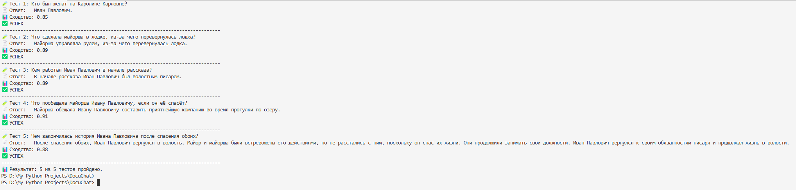
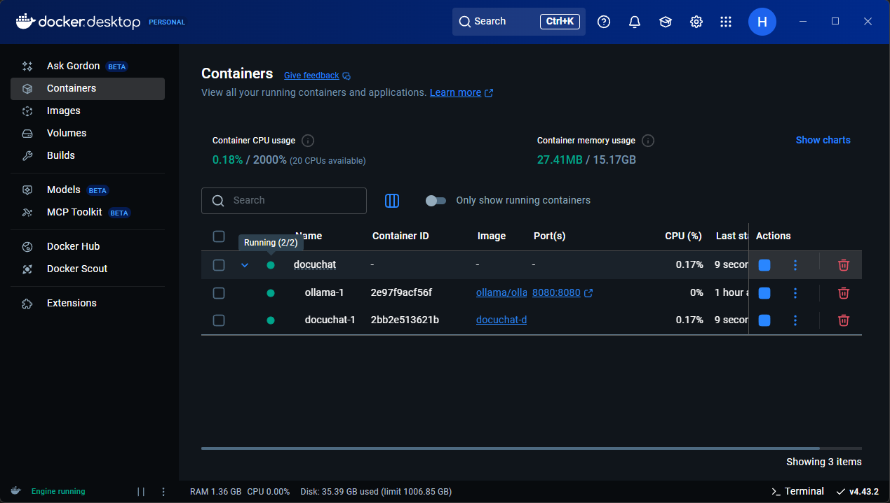

# 🧠 DocuChat — Semantic PDF Assistant with RAG, FAISS, and Auto-Tests

A semantic question-answering assistant for Russian-language PDF documents using **Retrieval-Augmented Generation (RAG)**, custom embeddings, and local LLM inference via **Ollama** (Mistral model).

This assistant extracts meaningful text chunks from PDF files, embeds them using Ollama-based SentenceTransformers, stores them in a **FAISS** vector database, and answers questions via **LangChain's RetrievalQA** pipeline.  
It includes automatic testing with **BERTScore** to ensure semantic accuracy of generated answers.

---

## 📌 Features

- ✅ **RAG Pipeline** — LangChain + FAISS
- 🔗 **Local LLM Inference** via Ollama + Mistral
- 📄 **Semantic Search on Russian PDFs**
- 🧪 **Custom Auto-Tests** using BERTScore (xlm-roberta-large)
- 🐳 **Dockerized Infrastructure** via `docker-compose`
- 📂 **100% Offline** — No OpenAI API required
- 🔐 **CLI interface** — ready for future Streamlit integration

---

## 🧪 Evaluation & Testing

The assistant was tested on the Russian-language short story:

> 🎓 **"За двумя зайцами погонишься — ни одного не поймаешь"**  
> *(by A.P. Chekhov)*

### Testing Process

- 📌 5 QA-pairs manually created based on the story  
- 📌 Answers generated using LangChain + Ollama (Mistral)  
- 📌 Semantic accuracy measured by **BERTScore (F1)**  
- 📌 All scores are **≥ 0.85**, indicating high-quality match

---

## 📊 Autotest Results

| Test № | Question                                  | BERTScore | Result     |
|--------|-------------------------------------------|-----------|------------|
| 1      | Кто был женат на Каролине Карловне?       | 0.85      | ✅ Passed   |
| 2      | Что сделала майорша в лодке?              | 0.89      | ✅ Passed   |
| 3      | Кем работал Иван Павлович?                | 0.89      | ✅ Passed   |
| 4      | Что пообещала майорша?                    | 0.91      | ✅ Passed   |
| 5      | Чем закончилась история?                  | 0.88      | ✅ Passed   |

📸 _CLI output screenshot:_  


---

## 🐳 Docker Status
The project is fully containerized and launched via docker-compose. After building, both containers (ollama-1 and docuchat) run successfully and communicate with each other without external dependencies.

✅ Example of a successful launch from VS Code terminal:


The screenshot shows both containers in active state and all services initialized correctly.

---

## ⚙️ Tech Stack

**Core**:  
Python, LangChain, FAISS, Ollama, Mistral, SentenceTransformers, torch, Docker, Docker Compose

**Testing**:  
BERTScore, scikit-learn

**Visualization / Automation**:  
Markdown, CLI, Jupyter Notebook, PDF, JSON

---

## 🚀 Quick Start

### 1. Clone the repo

```bash
git clone https://github.com/KalinNika/docuchat.git
cd docuchat
```

### Build and launch via Docker
**docker-compose up --build**

This launches:

ollama-1 container — LLM server (Mistral)
docuchat container — PDF parser, embedding generator, QA handler

### 🧪 Run tests:
**python3 autotest.py**

---

📜 License
MIT License — free to use, modify, and distribute.

